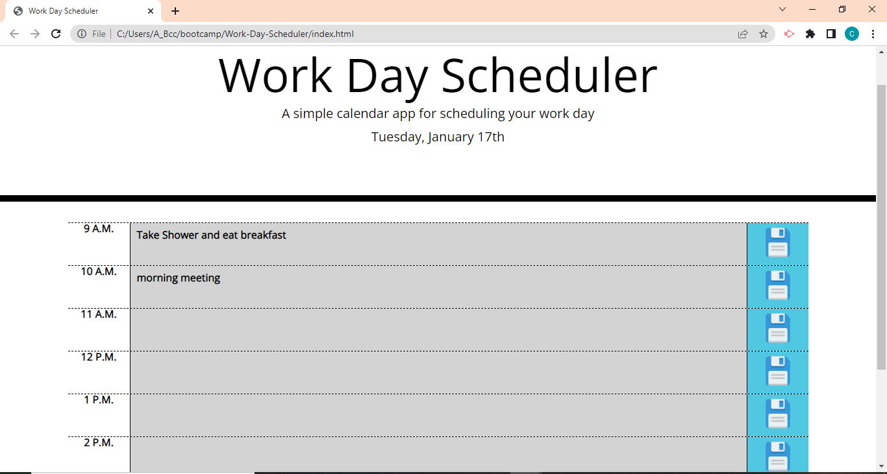

# Work-Day-Scheduler

## Description

Creating a website calendar application by modifying a provided started code. This application will allow users to save events for each hour of a standard work day. 

## Installation

N/A

## Usage

If you would like to download the code, here are the steps:
 - clone the repository 
 - open the folder in your IDE
 - to execute javascript, open the html in the browser

 also, to check scheduler directly, follow next link:

 https://luffykun20.github.io/Work-Day-Scheduler

 
 

## Features

- Scheduler will show the events if they are in the past, present , or future:
- when timeblock is on grey, it means the events already happened
- when timeblock is on red, it means the events are happening currently
- when timeblock is on green, it means the events did not happen yet

-All the events remain in the scheduler once they are modified; they willremain even after reload or reopen page
- All the events are saved in the user Local Storage 

## Credits

Bootstrap

https://getbootstrap.com/docs/4.3/getting-started/introduction/

Fontoawesome

https://fontawesome.com/start

Google Fonts

https://fonts.google.com/featured

## License

MIT